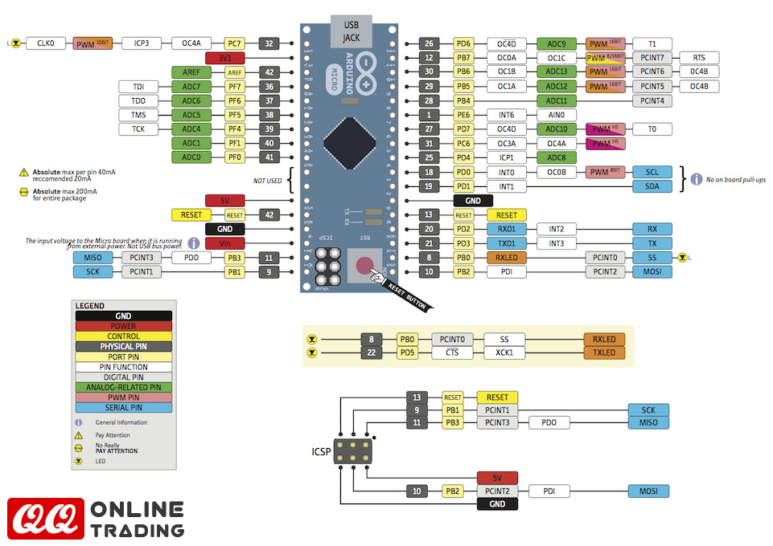
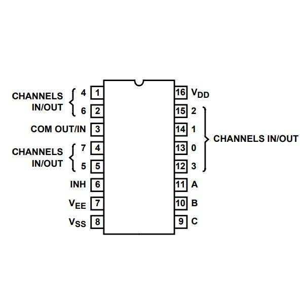

# MIDI CONTROLLER for DJing

# Features
- send MIDI messages based on the state of buttons, potentiometers and rotary encoders as well as display the state of software running on computer on RGB led strip.
- build environment for micro and nano
- uses multiplexer chip for reading more inputs

## Description
This project is an implementation of an arduino-based midi controller written in cpp using PlatformIO IDE for configuration for different boards.
Currently, it implements reading input from buttons, rotary encoders and potentiometers also in combination with multiplexing using CD4051BE multiplexer chip and output the incoming MIDI messages onto an individually addressable RGB LED strip using FastLED library.
The aim of this project is to create a generalized USB MIDI controller, so that creating a custom one is only as difficult as writing out the connections between the board and the components.

This project requires an arduino micro due to its ability to act as HID device, however, using a suitable communication protocol it is possible to use the arduino micro for MIDI message forwarding from another board, such as arduino mega for its abundance of pins or nano for its better price.

The current implementation is an effects unit with loop encoder and cue points for Serato DJ software. The controller contains 8 buttons and 2 rotary encoders connected to two multiplexers and 3 potentiometers connected directly. It also contains several leds for signalling. The main advantage of this controller is its size in comparison to existing products and advanced possibilities of midi mapping on the hardware side as well (for example, it enables me to use modifiers (for key combinations) which may not be available to use in the selected software).

## Board used:
The project uses Arduino Micro board due to its ability to act as HID device, however, other boards, such as Leonardo or Pro Micro can be used too. The pinout of the board is shown below. With its 12 digital and 6 analog pins, it can have up to 34 control elements connected when used in combination with multiplexers.

## Classes
### control element
- is a base class for implementation of control elements
- should allow to use elements within a multiplexer
#### button
- sets up a button 
#### pot
- sets up a pot which has sensitivity adjustment to prevent jumping around. From the hardware site of this implementation, I used 100nf capacitors between center and GND pins of potentiometers, so that the reading is less noisy.
Potentiometers need to be connected to a pin or a multiplexer pin that supports analog reading, such as pins A0 through A5 on the Arduino micro, therefore at most 34 (4*3 digital pins for addressing + 4 analog pins as multiplexer IO pins will result in 32 multiplexed pins and 2 potentiometers connected directly if we do not need leds or buttons)
- It is possible to use the potentiometer to modify the MIDI CC message's velocity or send different notes (to select value from a range in the software - for example, loop size).
#### encoder
- sets up a rotary encoder, its button is separate - treated as a button
- in multiplexer, pin 1 must precede pin2, pin1->changed is set to false after get_value
### Multiplexer
The chip used is CD4051BE, which contains 8 in/out pins addressable via 3bits (pins A, B C). Therefore, using 4 pins on the board, we can connect 8 control elements (using the basic ones I implemented is possible without limitations, however, it is not possible to use, for example a matrix keyboard via the multiplexer.) The pinout diagram of the chip is shown below.

### MIDI controls
Serves as handler for MIDI communication as well as pairing midi addressess with control elements and output leds.

## Build:
The controller was first tested using a breadboard and simple example code.

After successfully testing the MIDIUSB library with basic buttons and potentiometers, I went on to connect an arduino nano to a CD4051BE multiplexer with a rotary encoder connected to it (using the rotary encoder in a multiplexer is more challenging, as you need to read 2 pins to find out the state, but the multiplexer reads only one at a time). I connected a breadboard with two multiplexers and an arduino micro in order to create a more complex example. 

I used preprocessor directives and separate build environments (found in the platformio.ini file) for the different boards in order to exclude all MIDI functionality from the code on the nano board, as it would result in errors due to being unsupported by the MIDIUSB library.
Using these methods, it is possible to implement a communication protocol between the two devices and create more complex systems with more control elements processed by multiple arduino boards.

At this stage, I had implemented reading the control elements, using the multiplexer as well as sending it as midiusb messages. Nevertheless, sometimes the buttons and pots did not work, which I thought was due to bad wiggly wires in the breadboard, therefore I decided to move on to making PCBs. 

I spent a lot of time planning what elements to use and how to place them in regards to the mix I will be using the controller with.

However, due to my poor soldering skills, some of the control elements did not work properly again and although at some point most of the buttons worked, swithces and potentiometers did not. Therefore I decided to make yet another prototype, this time on a single board in order to prevent failures due to bending wires.

The third potentiometer was initially intended to be a slide potentiometer, however, I only had a logarithmic one and found its curve unusable for the purpose and now the button to activate the effect is weirdly placed in the bottom of the controller. 
In this version, the buttons and potentiometers kept on malfunctioning - not reacting on input in unpredictable patterns.I was very, very desperate at this point, however, I have noticed that the problem disappears right after restarting the board, which led me to discover that the problem was with debouncing during reading of the values. After removing the debouncing, everything worked flawlessly, therefore, the problem was probably either numerical in the debouncing code or overwlowing variable for storage of time stamps, although I cannot really explain either happening.
The last version also has WS2812 led strip for output of the state in the program.

The next iteration of the controller will have groups of control elements on boards with led outputs connected to the arduino via cable with connector, in order to create a modular controller useable with different combinations of other gear (for example attaching a group of buttons onto an empty place on a mixer by velcro in order to add new functions to the mixer). This, however will take a lot of time to "manufacture" while the code used will be nearly identical to the existing one (besides changes in pin layout and control elements used).

